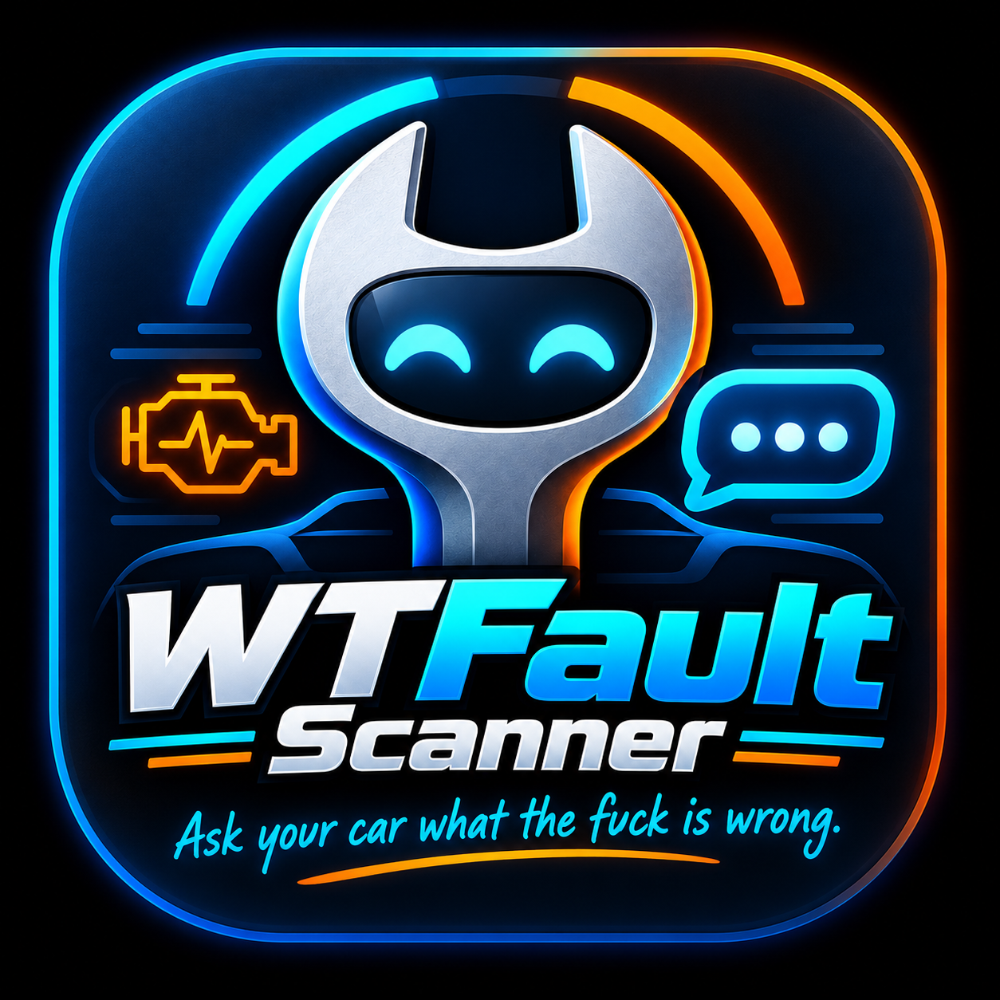
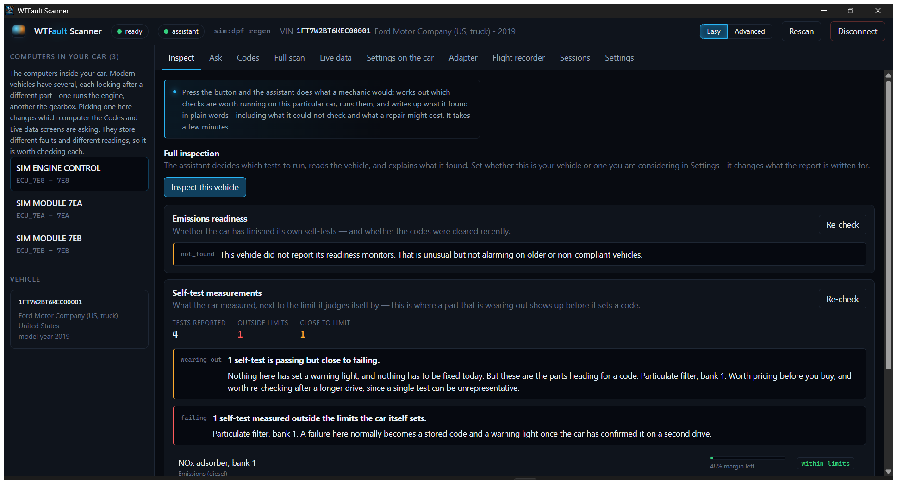
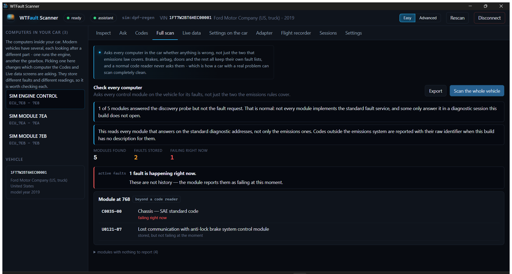
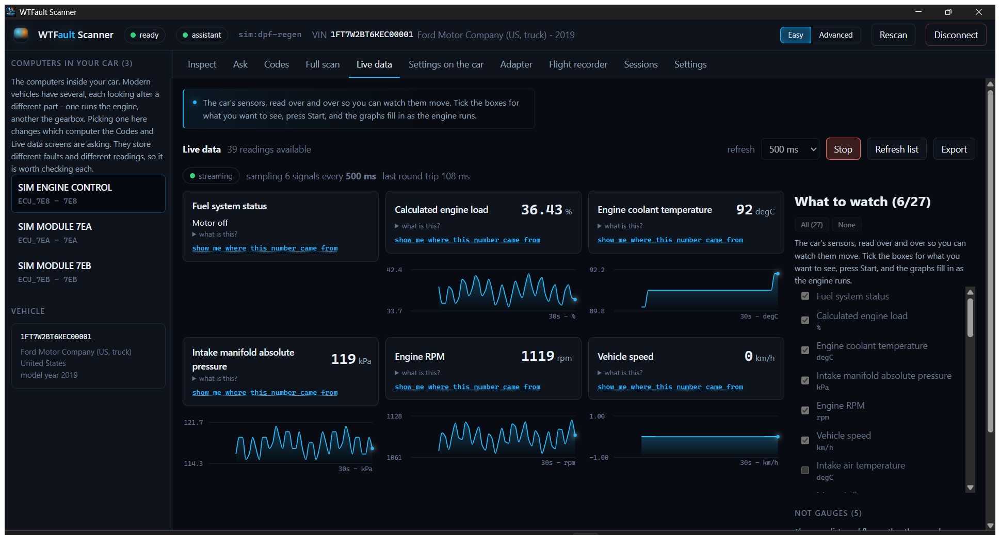
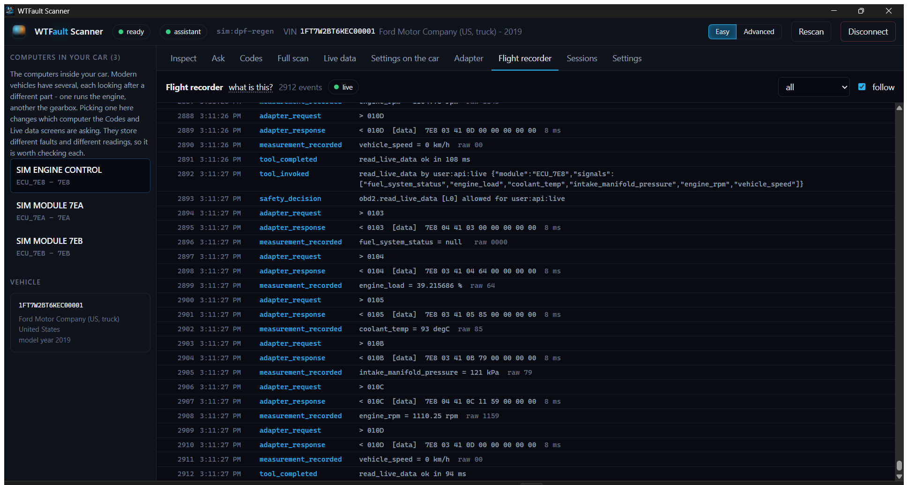

<div align="center">



# WTFault Scanner

### *Just ask your car what the fuck is wrong.*

An OBD-II scanner with a language model attached. The model can be wrong. What
it cannot do is hand you a guess wearing the label of something your car said.

[](https://github.com/christianOrona/wtfault-scanner/actions/workflows/check.yml)
[](#status)
[](https://github.com/christianOrona/wtfault-scanner/releases)
[](#licence)
[](#getting-started)

</div>

> **Work in progress.** It reads real vehicles today — verified on a 2019 F-250
> over a real adapter. The screenshots below are from the built-in virtual
> truck, which is said here rather than left for you to assume. It is also
> unfinished in ways worth knowing before you rely on it: see [Status](#status).

---

## What it is

Every cheap scanner tells you `P0420`. This one tells you what that means for
your car, what it would cost, what it could not check, and shows you the exact
conversation with the vehicle that produced the answer.

It also asks questions a code reader never asks. Most scanners read the
emissions system, because that is the part the law requires a car to expose.
Brakes, airbag, body and transmission modules are on the same wires answering
the same standard, and nobody asks them — which is how a car with a dead wheel
speed sensor scans completely clean.

```
                        ┌──────────────────────────────┐
   "what's wrong        │   language model             │   plain English,
    with my truck?" ───▶│   (Claude / local / any)     │──▶ with sources
                        └──────────────┬───────────────┘
                                       │ typed tool calls only
                        ┌──────────────▼───────────────┐
                        │   capability gate            │   refuses anything
                        │   + typed tool registry      │   not on the list
                        └──────────────┬───────────────┘
                        ┌──────────────▼───────────────┐
                        │   diagnostic core            │   every byte recorded
                        │   OBD-II (J1979) + UDS       │
                        └──────────────┬───────────────┘
                        ┌──────────────▼───────────────┐
                        │   adapter  ──▶  your vehicle │
                        └──────────────────────────────┘
```

---

## Why this and not a $30 scanner

Free is the least interesting thing about it.

### Bring your own brain

No scanner ties you to its vendor's cloud. This one does not tie you to
*anyone's*. The model is a setting:

| | |
|---|---|
| **Anthropic** | strongest reasoning, pay per scan, your data leaves the machine |
| **Ollama** | runs on your own hardware — a GPU box on your network, or this laptop |
| **xAI** | Grok, same deal as Anthropic |
| **Anything OpenAI-shaped** | point it at a URL and it works |

The tool layer is vendor-neutral JSON Schema, so switching from a hosted model
to a local one is a dropdown, not a rewrite. If you want a diagnostic tool that
sends nothing to anybody, run Ollama and it sends nothing to anybody. Try that
with a paid scan tool.

### It gets smarter without a new version

Everything it knows about vehicles is **data, not code** — sensor scaling, code
descriptions, plain-language explanations, configurable features. Drop a YAML
file in a folder, restart, done. No rebuild, no update, no waiting for a vendor
to decide your car is worth supporting.

That is also the honest answer to the manufacturer paywall. Nobody can
reverse-engineer four brands alone, but the method is mechanical — read the
configuration, change one setting with a known-good tool, read it again, diff —
and a hundred owners can. Everything loaded that way is labelled on screen with
the file it came from, so a wrong mapping is traceable to whoever supplied it.

### It knows the difference between reading and knowing

This is the part that has no equivalent anywhere. Three sources, always
labelled, never blended:

```
  measured        read from YOUR vehicle, this session, with the raw bytes
  code catalog    the standard SAE description
  AI knowledge    the model's own reasoning — NOT checked against your car
```

A repair-cost estimate is always the third one and always a range. A scanner
that shows you a confident dollar figure is showing you a guess wearing a
number's clothes.

### It looks where the law does not require

Emissions diagnostics are legislated, which is why every scanner reads them.
Brakes, airbag, body and transmission modules are on the same wires answering
the same ISO standard, and almost nothing asks them. This does.

Because it asks in the public standard rather than with proprietary
identifiers, the *asking* works on vehicles nobody wrote special code for — a
module that answers a fault request answers it the same way whoever built it.
Understanding the answer in detail is where manufacturers diverge, and that part
is data the app either has for your vehicle or admits it does not.

### It shows its working

Every number can show you the exact adapter exchange that produced it. Not a log
file — a click, from the number, to the bytes. That is what makes "it never
makes anything up" a checkable claim rather than marketing.

### It adapts to your hardware instead of assuming

The app measures what your adapter actually achieves and sizes its requests
accordingly. Plug in something faster and it goes faster, with no setting to
change. It finds your cable's line speed by sweeping, and recognises STN-series
hardware and uses the extra throughput.

---

## Four rules it will not break

**A measurement can only come from the vehicle.** Every number the app presents
as a reading carries the raw bytes it came from and can show you the adapter
exchange that produced it. A model can still be wrong in its reasoning — that is
what models do — but there is no path by which its prose becomes a value in the
measured column, because that column is populated from tool results and nothing
else.

**It separates what it measured from what it believes.** A fault read from your
vehicle, a description from the standard code catalogue, and the model's own
general automotive knowledge are three different things and are labelled as
three different things. Repair costs are always the third one.

**It says "I don't know".** An unnamed module is "the module at 7A8", not a
guess at what it probably is. A code with no catalogue entry keeps its
structural decoding and gets no description rather than an invented one.

**A change is not believed until it is seen.** Configuration writes exist, behind
a typed confirmation, a full precondition list, and a read-back: the record is
read, the masked bits changed, the record written whole, then read again and
compared. A module answering "accepted" is not a changed setting, and a write
that cannot be verified is reported as unverified with the final state unknown.
Programming and firmware are compiled off, and the assistant can reach none of
it.

---

## What it does

### Everything it found, explained



Plain questions, real answers, with every claim sourced. It decides which tests
are worth running, runs them, and tells you what it found — including what it
could not check.

Set whether you **own** the vehicle or are **thinking of buying it**, and the
whole report changes: an owner gets urgency and what they can fix themselves,
a buyer gets cost and negotiating position.

### Full vehicle scan



Sweeps every diagnostic address on the bus and asks whatever answers for its
fault memory. This reaches modules the emissions services cannot address, and
it distinguishes a fault **failing right now** from one merely **stored** from
an earlier drive — which the legislated services cannot tell you at all.

The transport and the services are ISO 14229, which is why this works on
vehicles nobody wrote special code for. What is **not** standard is everything
that makes an answer meaningful: which addresses a manufacturer put its modules
on, which identifiers hold which data, how a value is scaled, which diagnostic
sessions exist, and what security a module demands before it will talk. Those
are per-manufacturer, and the app treats them as data it either has for your
vehicle or honestly does not.

### Live data



Watch the sensors move. Every reading explained in a sentence, charts that
glide rather than stutter, and a signal budget worked out from what your
adapter actually achieves rather than from a hardcoded guess.

### Self-test measurements

The reading a code reader cannot give you. Your vehicle continuously grades its
own emissions systems, and OBD service 06 reports the measured value *next to
the limit it is judged by*. A catalyst reading 0.58 against a 0.60 limit is
passing — and about to stop. You see it months before it sets a code.

### Emissions readiness — the used-car check

Clearing trouble codes also resets every self-test, and they only finish again
after 50–100 miles of driving. A car with no stored codes but unfinished
self-tests was very probably cleared shortly before you arrived. The app says
so plainly, along with the honest caveat that a flat battery does the same
thing.

### Flight recorder



Every command sent and every reply received, in order, in an append-only log.
Click "show me where this number came from" anywhere in the app and land on the
exact exchange. This is what makes the honesty rules checkable rather than
promised.

### Easy or Advanced

One switch. **Easy** hides identifiers, hex and decoder provenance and puts a
plain sentence where you are already looking. **Advanced** shows everything.
Neither hides the evidence link — a simpler screen is not allowed to be a less
honest one.

---

## Try it without a car

There is a full virtual vehicle built in — a 2019 F-250 with a diesel, five
control modules, realistic sensor behaviour over time, and injectable faults.
Connect → **Virtual vehicle**. Everything works: scans, live data, the agent,
the flight recorder.

```
healthy      warm engine, no codes, particulate filter loading normally
dpf-regen    filter regeneration in progress, exhaust temperatures elevated
bus-silent   the adapter works and the vehicle does not answer
```

---

## Getting started

```bash
git clone <this repo>
cd wtfault-scanner/apps/desktop
npm install
npm run tauri:build      # installers land in src-tauri/target/release/bundle
```

Then point it at a model in **Settings**: Anthropic with an API key, or an
Ollama endpoint on your own hardware if you would rather nothing left the
machine.

> **Building from a fresh clone:** the desktop shell embeds the built UI, so
> `npm run build` has to run before the Rust side will compile. `npm run
> tauri:build` does both in the right order.

### Hardware

Any ELM327-class adapter works. The app measures what yours can actually do and
sizes its requests accordingly, rather than assuming the cheapest one — and it
recognises STN-series hardware (OBDLink and similar) and uses the extra
throughput.

It also finds the line speed for you. A wired cable that answers at 500000 baud
is found by sweeping, because nothing in the serial API can ask a device what
speed it is set to.

---

## Vehicle profiles: teaching it new things

Everything the app knows about vehicles is data, not code — PID scaling, code
descriptions, plain-language explanations, configurable features. Drop a YAML
file in the profiles folder and it loads at startup, no rebuild:

```yaml
signals:
  - id: fuel_injection_timing
    easy: "How early the diesel is squirted into the cylinder."
    technical: "Commanded start of injection relative to top dead centre."
```

Everything loaded this way is labelled on screen with the file it came from, so
a wrong mapping is traceable to whoever supplied it. **Settings → Vehicle
profiles** shows the folder and exactly what was read.

---

## What it will not do

Not a limitation to work around — a design decision:

- **Nothing in the braking, steering or throttle path.** Refused by risk class,
  permanently, whatever evidence exists. A tool you run in your own driveway on
  a vehicle you then drive on a road should not change how it stops.
- **Nothing to do with immobilisers, keys or firmware.** Not implemented, and
  a verified mapping would not change that.
- **Nothing that defeats an emissions control.** Illegal in most places, and
  refused with a reason rather than silently missing.
- **No invented repair costs.** Ranges only, always labelled as the model's
  general knowledge, never as a quote.

---

## Status

Working, on real vehicles, and unfinished. Both halves are true, so here is the
line between them.

**Works today, verified on hardware**

- OBD-II services 01–0A and UDS 0x10/0x19/0x22/0x3E over an ELM327-class adapter
- Full-bus module sweep, live data, Mode 06, readiness, session comparison
- The agent loop against Anthropic, xAI, Ollama or any OpenAI-shaped endpoint
- The flight recorder, and the evidence link from every number on screen

**Known gaps, in the order they matter**

- **Windows only in practice.** The core is portable and CI builds it on Linux,
  but the desktop shell has only ever been built and run on Windows.
- **Mode 06 scalings are unverified.** Pass/fail and margin are exact regardless,
  because they come from the same scaling on both sides — but the *units* on a
  monitor value are a best guess and are labelled as one.
- **Manufacturer-specific decoding is not there yet.** Everything is the public
  standard, which is why it works across brands; it also means a module can
  answer with a code nobody has a description for.
- **Profile import is folder-only.** Dropping a YAML file in works; importing one
  from a URL, with a count of how many people have verified it, does not exist.
- **RAM 2018 and newer** put a Security Gateway between the port and the bus. No
  standards-based tool reaches past it, this one included.
- **No verified configuration mapping ships.** The write path is built and
  tested end to end, and every feature in the catalogue has `mapping: null`
  because this project has measured none. That is a gap rather than a refusal:
  it closes when somebody measures one and drops in a profile file, with no new
  release. Refusals on risk grounds — brakes, keys, firmware — are the other
  kind, and the app says which one it is telling you.


---

## Documentation

| | |
|---|---|
| `STATUS.md` | where the project is, and what real sessions have shown |
| `docs/ARCHITECTURE.md` | crate map and design decisions |
| `docs/SAFETY.md` | the two ceilings, and what has to be true before a write |
| `docs/SECURITY.md` | threat model, credentials, and where your data goes |
| `docs/API.md` | the `/api/v1` contract |
| `docs/HANDOFF.md` | the specification this is built against |

---

## Development

```bash
./scripts/check.ps1        # tests, clippy, UI typecheck — about 20 s warm
cargo test --workspace
cargo run -p aim-adapter --example probe_port -- COM5    # what is on that port?
```

Screenshots above are from the virtual vehicle.

---

## Licence

Dual-licensed under either of

- Apache License, Version 2.0 ([LICENSE-APACHE](LICENSE-APACHE))
- MIT License ([LICENSE-MIT](LICENSE-MIT))

at your option. Unless you state otherwise, any contribution you intentionally
submit for inclusion in this work shall be dual-licensed as above, with no
additional terms.

### A word about what this touches

It talks to a vehicle. Read-only by construction, but a vehicle is not a text
editor: run it on a car you own or have permission to work on, and do not read
live data while driving. The licences above disclaim warranty, and that
disclaimer is not decoration here.
