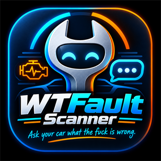
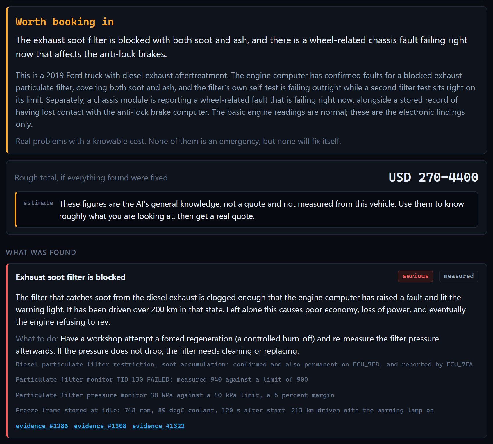
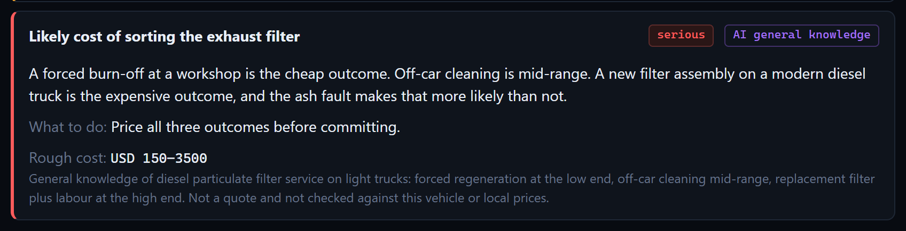
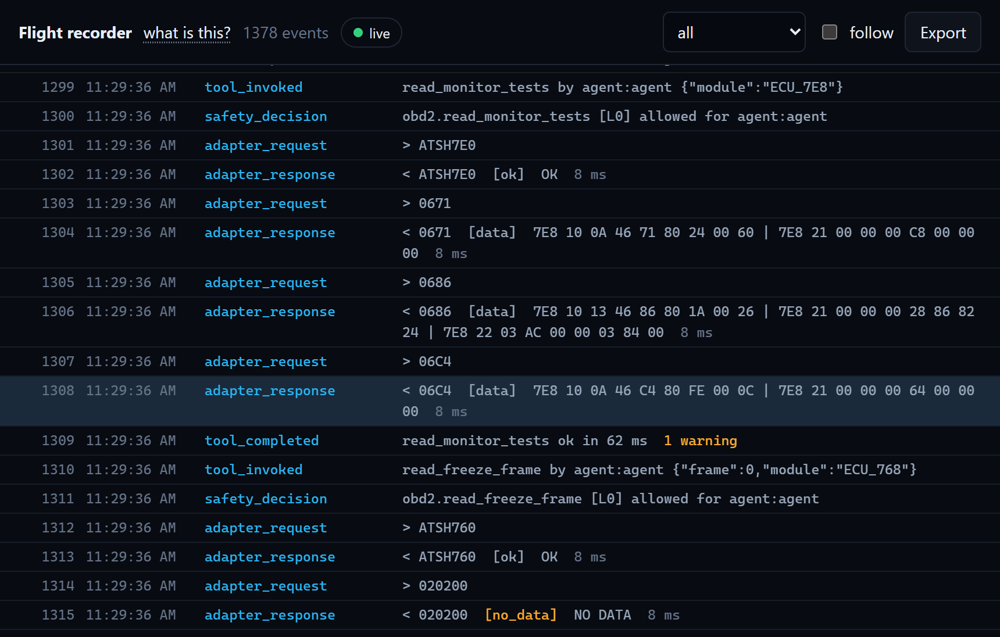
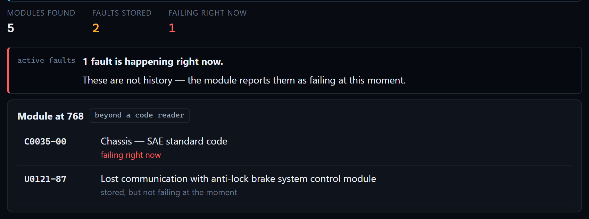
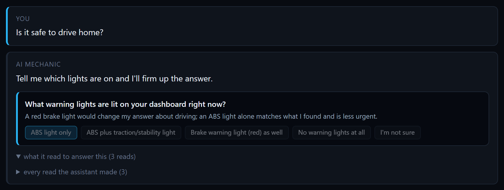
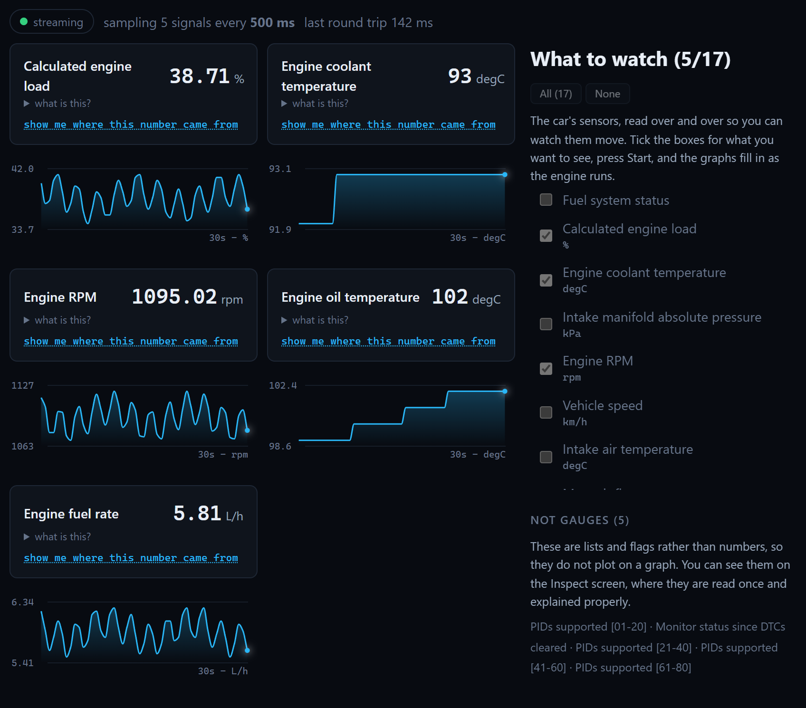
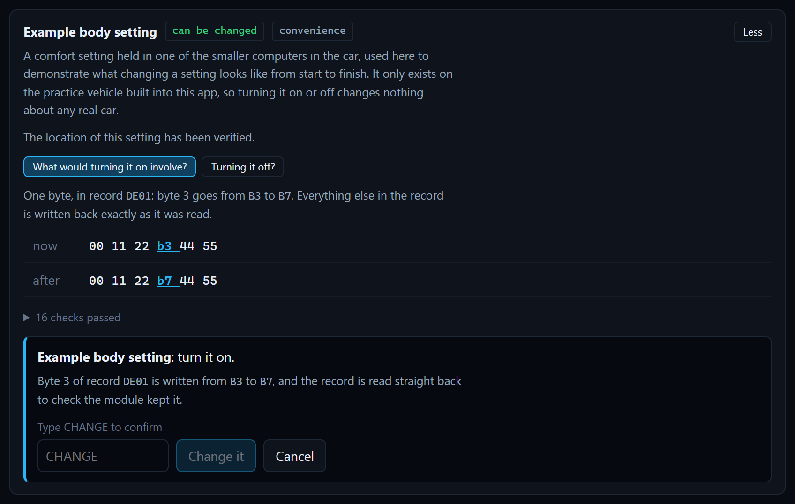

<div align="center">



# WTFault Scanner

### *Just ask your car what the fuck is wrong.*

An open-source OBD-II scanner that asks every computer it can reach in your
car what it knows, explains the answer in plain English, and shows you the raw
evidence behind every claim.

[](https://github.com/christianOrona/wtfault-scanner/releases/latest)
[](#no-car-try-it-anyway)

[](https://github.com/christianOrona/wtfault-scanner/actions/workflows/check.yml)
[](https://github.com/christianOrona/wtfault-scanner/releases)
[](#licence)
[](#get-started)
[](#where-it-stands)



<sub>Not a mock-up and not edited: this is what the app produced, written up by
Claude. Every line marked <code>measured</code> links to the bytes it came from.</sub>

**Every screenshot on this page is the built-in virtual F-250, not a real
truck.**

</div>

---

## Your car already knows what is wrong

Most cheap scanners give you `P0420` and leave you to figure out what it means.
This one tells you what it means for your car, what it could cost, what it
could not check, and shows you the exact conversation with the vehicle that
produced the answer.

It also asks questions a code reader never asks. The emissions system is the
part the law requires a car to expose, so that is the part that gets read.
Brakes, airbag, body and transmission modules can be sitting behind the same
diagnostic connection, and most cheap scanners never ask them. That is how a
car with a dead wheel speed sensor scans completely clean.

```
your car  →  adapter  →  every byte recorded  →  the model reads it  →  you, with sources
```

Free is the least interesting thing about it.

---

## AI that shows its receipts

The model can be wrong. What it cannot do is hand you a guess wearing the label
of something your car said. Three sources, always labelled, never blended:

```
  measured        read from YOUR vehicle, this session, with the raw bytes
  code catalog    the standard SAE description
  AI knowledge    the model's own reasoning — NOT checked against your car
```



A repair cost is always the third kind and always a range. A scanner that shows
you a confident dollar figure is showing you a guess wearing a number's clothes.



Every number is one click from the adapter exchange that produced it. Not a log
file to go digging in: a click, from the claim to the bytes. That is what makes
"it does not make things up" something you can check rather than something we
say.

Four rules it will not break:

- **A measurement can only come from the vehicle.** There is no path by which a
  model's prose becomes a value in the measured column. That column is filled
  from what the adapter returned and nothing else.
- **It says "I don't know."** An unnamed module is "the module at 768", not a
  guess at what it probably is. The report above does it: a chassis fault this
  build has no description for is reported as exactly that.
- **It tells you what it could not check.** Every report carries the list,
  because a clean scan is not a clean car.
- **A change is not believed until it is seen.** A module answering "accepted"
  is not a changed setting. The record is read back and compared.

---

## What it does

### Diagnose



**Every computer, not just the two the law covers.** A full scan sweeps every
diagnostic address your adapter can reach and asks whatever answers for its
faults. No AI is involved and nothing is spent. It tells a fault **failing
right now** from one merely **stored** from an earlier drive, which the
legislated services cannot tell you at all.

- **AI inspection.** One button. It decides which checks are worth running,
  runs them and writes the report at the top of this page. Tell it whether you
  **own** the vehicle or are **thinking of buying it**, and the whole report
  changes.
- **Self-test results.** Your car grades its own emissions systems and reports
  the measured value *next to the limit it is judged by*. A catalyst reading
  0.58 against a 0.60 limit is passing, and about to stop. You see it months
  before it sets a code.
- **The used-car check.** Clearing trouble codes also resets every self-test,
  and they only finish again after 50 to 100 miles. No codes but unfinished
  self-tests means the car was very probably cleared shortly before you
  arrived. The app says so, with the honest caveat that a flat battery does
  the same thing.

### Understand



**Ask it anything.** Plain questions, in your own words. It reads whatever it
needs from the car to answer, shows you what it read, and asks you back when
the answer depends on something only you can see.



**Live data that explains itself.** Every reading can say what it is in a
sentence, and the number of signals is worked out from what your adapter
actually achieves rather than from a hardcoded guess.

- **What changed since last time.** Every scan is kept, and two visits to the
  same vehicle can be compared: which faults appeared, which are gone, which
  readings moved.
- **Easy or Advanced.** One switch. Easy hides identifiers and hex. Neither
  hides the evidence link: a simpler screen is not allowed to be a less honest
  one.

### Change



**One setting at a time, carefully.** Some things about a car are switched on
or off in its computers rather than repaired. The app shows the exact byte that
would change, checks its preconditions, makes you type a word, writes, and
reads the record back.

Today that means **two settings verified on one 2019 F-250** (door auto-lock,
and the double honk when you walk away), four more mapped and not yet verified,
and a practice setting on the virtual truck. It takes more than a cheap
adapter (see [Get started](#get-started)).

### Take it with you

- **Reports.** Copy the report as text or save it, source labels included, and
  export codes and live data as CSV.
- **Laptop and phone.** Export the database on one device and import it on
  another. Sessions are filed under the vehicle by its VIN.
- **Android, as a preview.** The same app on a phone. See
  [Get started](#get-started) for what is untested.

---

## No car? Try it anyway

Virtual vehicles are built in. Connect → **Virtual vehicle**, then pick one.
Everything works: scans, live data, the assistant, the flight recorder.

```
f250         2019 F-250 diesel: 11-bit CAN, a second bus, five control modules
odyssey      2023 Honda Odyssey, petrol: 29-bit CAN
toyota       2004 Toyota, petrol: the K-line, from before CAN
```

Each runs a scenario, with realistic sensor behaviour over time:

```
healthy      warm engine, no codes, particulate filter loading normally
dpf-regen    filter regeneration in progress, exhaust temperatures elevated
bus-silent   the adapter works and the vehicle does not answer
parked       key on, engine off: the state a setting is changed in
```

Every screenshot on this page is the `f250` in `dpf-regen`, or in `parked` for
the setting change.

---

## Get started

**1. Download.** Windows installers are on the
[releases page](https://github.com/christianOrona/wtfault-scanner/releases/latest):
the `-setup.exe` for most people, the `.msi` for managed installs. They are
built by [the release workflow](.github/workflows/release.yml) from a tagged
commit, and each release lists SHA-256 checksums. They are **not code signed
yet**, so Windows SmartScreen warns before the installer runs. Signing has been
applied for through SignPath Foundation ([policy](docs/CODE_SIGNING.md)).

**2. Connect.** Plug an adapter into the car, or pick the virtual vehicle.

Any ELM327-class adapter can **read** the main bus. The app measures what
yours achieves and sizes its requests to it, finds a wired cable's line speed
by sweeping, and uses the extra throughput of STN-based hardware (OBDLink and
similar).

Two things take more than a cheap clone. **Changing a setting** needs an
STN-based adapter (the OBDLink MX+ is the one tested here): a clone refuses to
transmit a request that long. And a **second bus**, where some vehicles keep
their body modules, needs an adapter that can reach it.

**3. Inspect.** A full scan needs nothing else. For the AI report and Ask, add
a model in **Settings**.

**Android is a preview.** Each release since 0.6.0 has an `.apk` and the app
runs in the emulator, but its Bluetooth link has not been tested against a real
adapter yet. See [docs/ANDROID.md](docs/ANDROID.md).

**From source:**

```bash
git clone https://github.com/christianOrona/wtfault-scanner.git
cd wtfault-scanner/apps/desktop
npm install
npm run tauri:build      # installers land in src-tauri/target/release/bundle
```

---

## Bring your own brain

There is no WTFault cloud and no WTFault account. The model is a setting, and
a hosted one is your choice, on your own key:

| | |
|---|---|
| **Anthropic** | strongest reasoning, pay per scan, your data leaves the machine |
| **Ollama** | runs on your own hardware: a GPU box on your network, or this laptop |
| **xAI** | Grok, same deal as Anthropic |
| **OpenRouter (free)** | free models with a free key and no GPU. Built, and not yet run end to end on a real key. Whoever serves a free model may keep what it is sent |
| **Anything OpenAI-shaped** | point it at a URL |

The tool layer is vendor-neutral JSON Schema, so switching from a hosted model
to a local one is a dropdown, not a rewrite. If you want a diagnostic tool
whose AI traffic never leaves your network, run Ollama on your own hardware.
Try that with a paid scan tool.

That is the AI. The app still checks GitHub for updates, and goes online for a
VIN or a profile only when you ask. The
[privacy policy](docs/CODE_SIGNING.md#privacy-policy) lists every case.

---

## It gets smarter without a new version

Everything it knows about vehicles is **data, not code**: sensor scaling, code
descriptions, plain-language explanations, configurable settings. Add a profile
from the app, from a file or a URL, or drop one in the profiles folder. It
applies on the next connection. No rebuild, no update, no waiting for a vendor
to decide your car is worth supporting.

```yaml
signals:
  - id: fuel_injection_timing
    easy: "How early the diesel is squirted into the cylinder."
    technical: "Commanded start of injection relative to top dead centre."
```

That is also the honest answer to the manufacturer paywall. Nobody can
reverse-engineer four brands alone, but the method is mechanical (read the
configuration, change one setting with a known-good tool, read it again, diff)
and a hundred owners can. Everything loaded this way is labelled on screen with
the file it came from, so a wrong mapping is traceable to whoever supplied it.

---

## What it will not do

Not a limitation to work around. A design decision:

- **Nothing in the braking, steering or throttle path.** Refused by risk class,
  permanently, whatever evidence exists. A tool you run in your own driveway on
  a vehicle you then drive on a road should not change how it stops.
- **Nothing to do with immobilisers or keys, and no writing of firmware.** It
  sends no security key and contains no algorithm to make one. It can read
  which software a module says it runs ([docs/CALIBRATION.md](docs/CALIBRATION.md));
  it never programs or flashes one.
- **Nothing that defeats an emissions control.** Illegal in most places, and
  refused with a reason rather than silently missing.
- **No invented repair costs.** Ranges only, always labelled as the model's
  general knowledge, never as a quote.

---

## Where it stands

Working, on real vehicles, and unfinished. Both halves are true.

**Run on real hardware:** four vehicles (two 2019 F-250s, a 2012 F-250 and a
2023 Honda Odyssey), three adapters, 41 recorded sessions and about 54,500
logged exchanges. 11-bit and 29-bit CAN. Both CAN buses, given an adapter
that reaches the second: the same F-250 answers with 7 modules on the
legislated bus and 29 more on the other.

**Know before you rely on it:**

- **Windows is the tested platform.** Android is a preview.
- **It asks in the public standards, OBD-II and UDS, which is why the asking
  works across makes.** What an answer *means* in detail is per-manufacturer
  data, and the app has it for few vehicles so far. On an unfamiliar car,
  expect some modules listed by address and some codes with no description. It
  will say which.
- **Units on self-test values are a best guess** and labelled as one. Pass,
  fail and margin are exact regardless.
- **Vehicles from before CAN have only met the simulator.**
- **RAM 2018 and newer** put a security gateway between the port and the bus.
  No standards-based tool reaches past it, this one included.

[`STATUS.md`](STATUS.md) is the unvarnished version: what real sessions
showed, including the day it turned out to be a Ford-only scanner and nobody
knew.

---

## Documentation

| | |
|---|---|
| [`STATUS.md`](STATUS.md) | where the project is, and what real sessions have shown |
| [`CHANGELOG.md`](CHANGELOG.md) | what changed in each release |
| [`CONTRIBUTING.md`](CONTRIBUTING.md) | how to help: a recording from your car, a profile, or code |
| [`docs/ARCHITECTURE.md`](docs/ARCHITECTURE.md) | crate map and design decisions |
| [`docs/SAFETY.md`](docs/SAFETY.md) | the two ceilings, and what has to be true before a write |
| [`docs/SECURITY.md`](docs/SECURITY.md) | threat model, credentials, and where your data goes |
| [`docs/CODE_SIGNING.md`](docs/CODE_SIGNING.md) | how releases are built and signed, and the privacy policy |
| [`docs/CALIBRATION.md`](docs/CALIBRATION.md) | which software a module runs, and matching a calibration file to it, read-only |
| [`docs/REPORTS.md`](docs/REPORTS.md) | problem reports: what Send does, and running the endpoint |
| [`docs/ANDROID.md`](docs/ANDROID.md) | the Android app: installing, building, signing, and how it differs |
| [`docs/AT-THE-CAR.md`](docs/AT-THE-CAR.md) | what to check next time a vehicle is connected |
| [`docs/RELEASING.md`](docs/RELEASING.md) | cutting a release: what to bump, in what order, and the traps |
| [`docs/API.md`](docs/API.md) | the `/api/v1` contract |
| [`docs/KNOWLEDGE-ENGINE.md`](docs/KNOWLEDGE-ENGINE.md) | what was borrowed, what was rejected, and why |
| [`docs/HANDOFF.md`](docs/HANDOFF.md) | the specification this is built against |

## Development

```bash
./scripts/check.ps1        # everything CI checks: tests, clippy, UI typecheck
cargo test --workspace
cargo run -p aim-adapter --example probe_port -- COM5    # what is on that port?
```

A Rust core and a React interface in Tauri.
[CONTRIBUTING.md](CONTRIBUTING.md) covers what a change needs and what will
not be merged.

---

## Standing on other people's work

Almost every hard-won thing in this application was learned somewhere first.
Some of it is a licence obligation to say so; the rest is just true.

**Data this project uses**

- **[OBDb](https://github.com/OBDb)**: a community documenting the diagnostic
  parameters, scalings and codes that vehicles answer to, across roughly 740
  makes and models. The bundled signalset comes from there and is used under
  **CC BY-SA 4.0**; see
  [`vehicle-profiles/catalog/obdb/ATTRIBUTION.md`](vehicle-profiles/catalog/obdb/ATTRIBUTION.md).
  It is what lets this app ask a vehicle a question nobody here had to reverse
  engineer.
- **[NHTSA vPIC](https://vpic.nhtsa.dot.gov/)**: the US government's free VIN
  decoder, asked only when you press the button.

**Behaviour learned by reading, and reimplemented independently**

These are GPL and this project is MIT/Apache, so no code was taken from either.
What was taken is knowledge of how ELM327 adapters and vehicles actually behave
(facts about hardware, not anybody's expression) and the difference matters
enough to say plainly.

- **[python-OBD](https://github.com/Ircama/python-OBD)** (Ircama's maintained
  fork, and [Brendan Whitfield's](https://github.com/brendan-w/python-OBD)
  original): checking the socket is powered before sweeping protocols, and a
  faster way to find an adapter's line speed.
- **[AndrOBD](https://github.com/fr3ts0n/AndrOBD)** by fr3ts0n: years of field
  knowledge about what real adapters do when they misbehave. Which error
  strings actually appear, that `NABLETO` is a truncated `UNABLE TO CONNECT`,
  that a warm start recovers where a full reset is overkill, and that a
  response timeout is worth learning rather than assuming.

**Ideas and architecture**

- **[odxtools](https://github.com/mercedes-benz/odxtools)** (Mercedes-Benz):
  separating a reusable data definition from the parameters that reference it.
- **[EcuBus-Pro](https://github.com/ecubus/EcuBus-Pro)**: what a serious
  automotive diagnostic application looks like when protocol, hardware,
  database and interface are kept apart.
- **[opendbc](https://github.com/commaai/opendbc)** (comma.ai): identifying a
  vehicle from what its ECUs report, rather than asking someone to pick from a
  list.
- **[FORScan](https://forscan.org)** and the community around it, whose
  documentation of Ford as-built configuration is why the block↔identifier
  correspondence was worth going looking for at all.
- **[automotive_diag](https://crates.io/crates/automotive_diag)**: a
  permissively-licensed Rust home for the diagnostic tables this project
  currently hand-writes.
- **rwd-xray**: a public description of Honda's RWD package format, which the
  read-only header reader follows.

---

## Licence

Dual-licensed under either of

- Apache License, Version 2.0 ([LICENSE-APACHE](LICENSE-APACHE))
- MIT License ([LICENSE-MIT](LICENSE-MIT))

at your option. Unless you state otherwise, any contribution you intentionally
submit for inclusion in this work shall be dual-licensed as above, with no
additional terms.

### A word about what this touches

It talks to a vehicle, and it can change one. Reading is free; writing a
configuration setting takes a typed confirmation, and the assistant cannot
reach that path at all. Programming and flashing are compiled out, and nothing
in the braking, steering or throttle path is in scope at any level.

A vehicle is not a text editor. Run it on a car you own or have permission to
work on, and do not read live data while driving. The licences above disclaim
warranty, and that disclaimer is not decoration here.
